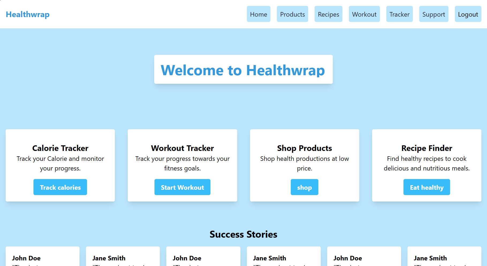

# HealthWrap

HealthWrap is a full-stack application designed to provide comprehensive health and wellness resources. It includes features like user authentication, product listings, recipe suggestions, workout tracking, and support services. This application is built using React, MongoDB, and Node.js.

## Features

- **Home**: Displays success stories and health articles, fetched from external APIs.
- **Products**: Browse and manage health products, with data stored and retrieved from MongoDB via Node.js.
- **Recipes**: Find healthy recipes using the Edamam API.
- **Workout Tracker**: Track and store your workout progress.
- **Support**: A support component for user queries and assistance.
- **User Authentication**: Implemented using Auth0 to manage user sessions securely.

## Installation

To set up the project locally, follow these steps:

1. Clone the repository: git clone <repo>

2. Navigate to the project directory: cd reponame

3. Install the required dependencies: npm install

4. Start the server: node server,npm start

## Usage

Once the application is running, open your web browser and go to `http://localhost:3000` to view the app.

## Screenshots 

## Contributing

Contributions are welcome! Please feel free to submit pull requests or create issues for bugs and feature requests.

## License

